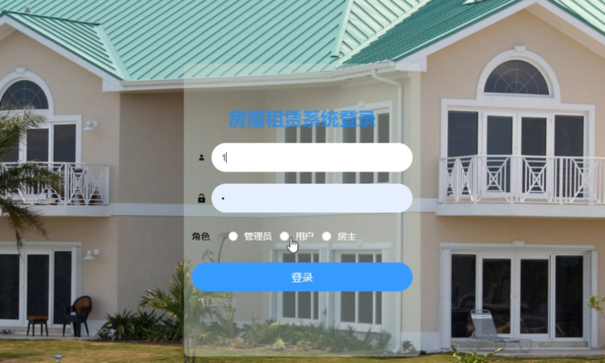
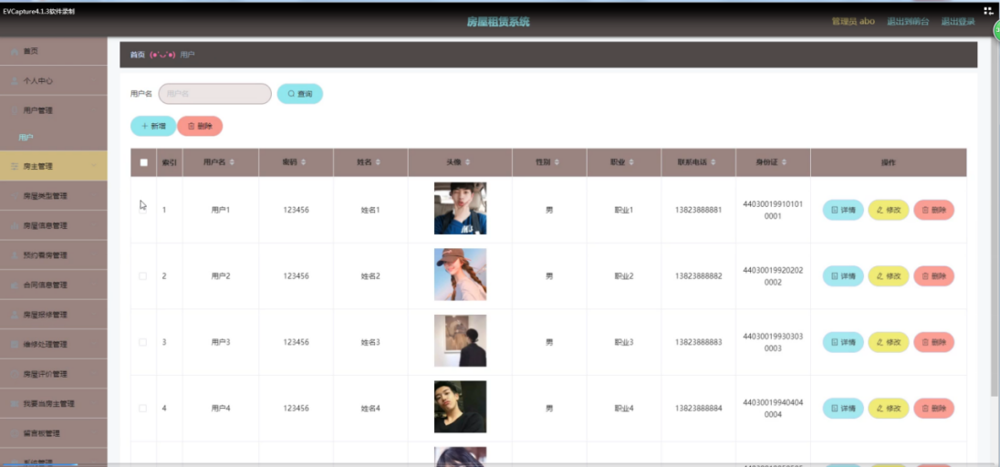
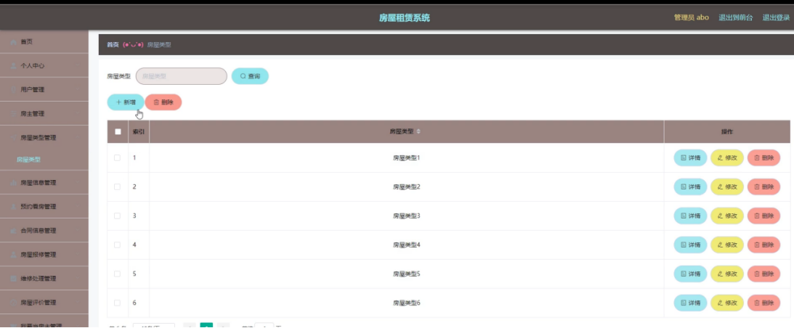
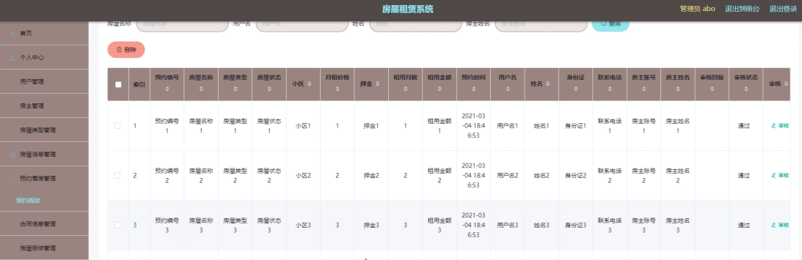

# springboot008-基于SpringBoot的房屋租赁系统

>  博主介绍：
>  Hey，我是程序员Chaers，一个专注于计算机领域的程序员
>  十年大厂程序员全栈开发‍ 日常分享项目经验 解决技术难题与技术推荐 承接各类网站设计，小程序开发，毕设等。
>  【计算机专业课程设计，毕业设计项目，Java，微信小程序，安卓APP都可以做，不仅仅是计算机专业，其它专业都可以】

## 3000套系统可挑选，获取链接：https://chaerspol.github.io/

<b>QQ【获取完整源码】：674456564</b>

<b>QQ群【获取完整源码】：1058861570</b>

### 系统架构

> 前端：html | js | css | jquery | vue
>
> 后端：springboot | mybatis
> 
> 环境：jdk1.8+ | mysql | maven

# 一、内容包括
包括有  项目源码+项目论文+数据库源码+答辩ppt+远程调试成功

# 二、运行环境

> jdk版本：1.8 及以上； ide工具：IDEA； 数据库: mysql5.7及以上；编程语言: Java

# 三、需求分析

任何一个项目在开发研究前，都需要对研发系统本身的需求做一个认真的分析，市场的调研是不可忽视的，从实际场景中确定使用人员的功能需求，从而明确目标，对整个系统的开发有一个更加准确的定位，在这个章节，需要对系统的性能分析，业务流程分析，和数据等进行分析，房屋租赁系统的整体界面简单，功能完善。
需求的可行性是分析和讨论发达的系统能达到什么样的要求。开发的系统平台是否符合之前的要求。只有在房屋租赁系统的开发中，才能在系统开发和实施之前完成需求。如果您不具备开发一个功能不合格的系统的可行性，那就是开发失败。开发系统是否有用，可以完成之前讨论过的需求，以下分析了房屋租赁系统的实际需求。
系统设计需要从用户、房东和管理员的实际需求开始，以了解他们需要实施哪些功能以及他们可以包括哪些管理工作。
考虑到房屋租赁系统设计的特点，应满足几个要求：

（1）它可以通过网络开展房屋租赁系统信息管理工作，促进对房屋信息和预约信息、留言信息、、维修信息、评论信息注册信息的统一管理。

（2）学习方法变得更加多样化，管理更加标准化;

（3）它提供了一个免费的渠道，以确保数据的实时有效沟通。

# 四、功能模块

房屋租赁系统的设计主要是为了满足用户的实际需求。 因此，它需要通过Internet实现，因此它必须具备硬件和软件基础。该平台最终可以通过科学技术和各种方式达到支持智能化的信息管理的目的。因此，它必须具备网络学习平台管理所需的环境和各种资料，并保证实现开放性，模块性和实用性三个原则。房屋租赁系统的结构，系统实现的功能模块如下图所示。

# 五、部分效果图展示

图5-1管理员登录界面图【管理员通过填写用户名、密码、选择权限进行登录，进入后台系统，管理员登录成功后，进入后台页面，可以进行查看个人中心、房屋类型管理、房屋信息、预约看房管理、合同信息管理、房屋报修管理、房屋评价管理、我要当房东管理、留言板管理、系统管理等功能模块，进行相对应操作。】

图5-2房东管理页面【房主管理：通过列表可以获取用户名、密码、姓名、头像、性别、职业、联系方式、身份证号、进行查看用户信息或修改删除操作还可以通过新增进行添加用户信息操作】

图5-3房屋类型界面图【房屋类型管理：通过列表可以进行查看房屋类型，进行查看详情或修改、删除操作，并通过新增进行添加类型信息】

图5-4预约看房管理界面图【预约看房管理：通过列表可以获取预约编号、房屋名称、房屋类型、房屋状态、房屋状态、小区、月租价格、押金、租用月数、租用金额、预约时间、用户名、姓名、身份证、联系电话、房主账号、房主姓名、审核回复、审核状态等信息、进行查看详情信息操作】

图5-5首页页面【用户通过登录进入房屋租赁系统页面可以进行查看系统的首页、房屋信息、我要当房东、公告信息、留言反馈、个人中心、后台管理等功能模块进行相对应操作】

 <b>完整文章</b>

 

## 3000套系统可挑选，获取链接：https://chaerspol.github.io/

<b>QQ【获取完整源码】：674456564</b>

<b>QQ群【获取完整源码】：1058861570</b>

